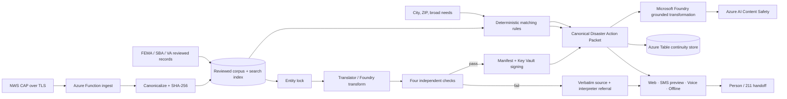

# Architecture and trust boundaries

## Decision ownership

| Decision | Owner | AI allowed? |
|---|---|---|
| Is an address in a warning polygon? | Geometry algorithm | No |
| Is an action present in an alert? | CAP `instruction` offsets | No |
| Is a program a possible match? | Reviewed deterministic rules | No generative decision |
| How is a match explained? | Microsoft Foundry over supplied source fields | Yes, verified and caveated |
| Does a transformation add a claim? | Deterministic guards + Foundry entailment judge | AI is one independent check |
| Is someone eligible? | Authoritative agency | Never |
| Is an alert authentic? | Origin and agency processes | Never claimed by this app |

## Protocol invariants

- A channel is a compiled view, not a separate source of truth.
- Government IDs, deadlines, jurisdiction, and other locked facts remain byte-for-byte present in channel metadata.
- The packet signature covers canonical state and compiled channels; a channel hash detects drift.
- A recovery code points to minimal packet state for 24 hours and excludes names, exact addresses, SSNs, bank data, and documents.
- Historical snapshots always carry their timestamp and current-status warning into every channel.

## Data minimization

`POST /api/navigate` processes a coarse location, selected needs, optional broad circumstances, and urgency. It does not write the request to the alert/render store. An address is used only for geocoding and polygon math. Logs must exclude request bodies in production. Application data is entered only after the user follows an official agency link.

## Failure behavior

- Foundry unavailable → reviewed deterministic copy.
- Translator unavailable → curated Spanish fixture where exact coverage exists; otherwise verbatim English with referral.
- Speech unavailable → browser/device voice.
- NWS unavailable or no active alert → explicitly labeled cached demo fixture.
- Geocoder unavailable → coarse cached demo locality, visibly labeled.
- Entailment judge unavailable in configured Foundry mode → segment abstains.
- Missing CAP instructions → description only; no inferred actions.
- Signing mismatch or rendered text changed → verification fails.

## Production controls

- Managed identity for App Service and Function App.
- Key Vault RBAC; rotate signing keys and include key IDs in manifests.
- Azure Table Storage for multi-instance continuity codes; no phone number, name, or exact address is stored.
- Private endpoints for Storage and Key Vault where agency networking supports them.
- Azure Monitor metrics without citizen request bodies.
- Source-review workflow with versioned program records, owner, last-reviewed date, and retirement date.
- Content Security Policy and an explicit allowlist for outbound application links.
